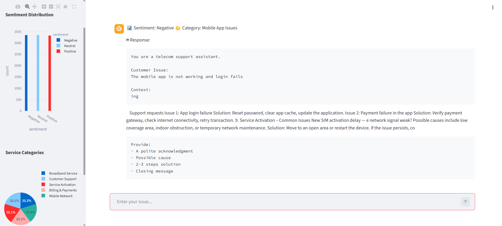

# 📡 Telecom AI Brand Intelligence System


---

## 🚀 Overview

This project is an **AI-powered Telecom Brand Intelligence System** designed to analyze customer feedback automatically using Natural Language Processing (NLP) and Retrieval-Augmented Generation (RAG).

Telecom companies receive massive volumes of unstructured customer feedback. This system helps transform that data into **actionable insights** using AI.

---

## 🖼️ Application Preview

> 📌 Add your screenshot file in the repo as `screenshot.png`



---

## 🧠 Key Features

✔ Sentiment Analysis (Positive / Neutral / Negative)
✔ Telecom Service Category Classification
✔ Retrieval-Augmented Generation (RAG)
✔ AI-generated customer support responses
✔ Chat-based user interface (like ChatGPT)
✔ Interactive analytics dashboard (Plotly)
✔ Login authentication system

---

## 🏗️ Architecture

```
User Input
   ↓
Sentiment Analysis (Transformer Model)
   ↓
Topic Classification
   ↓
RAG (FAISS + Embeddings)
   ↓
LLM Response Generation
   ↓
Visualization Dashboard
```

---

## 🛠️ Tech Stack

| Component       | Technology               |
| --------------- | ------------------------ |
| Language        | Python                   |
| NLP Models      | HuggingFace Transformers |
| Embeddings      | Sentence Transformers    |
| Vector Database | FAISS                    |
| LLM             | Flan-T5                  |
| Frontend        | Streamlit                |
| Visualization   | Plotly                   |
| Deployment      | Streamlit + ngrok        |

---

## 📊 Use Cases

* 📶 Mobile Network Issues (call drops, weak signal)
* 🌐 Broadband Problems (slow internet, disconnections)
* 💳 Billing Complaints (unexpected charges)
* 📱 Mobile App Issues (login/payment failures)
* ⚡ Service Activation Delays

---

## 🎯 Business Value

* Improves customer experience
* Detects recurring service issues
* Enables real-time sentiment tracking
* Supports data-driven decision making
* Reduces manual analysis effort

---

## ▶️ How to Run the Project

### 🔹 1. Clone the repository

```bash
git clone https://github.com/dhivyapriyaa22/telecom-ai-brand-intelligence.git
cd telecom-ai-brand-intelligence
```

---

### 🔹 2. Install dependencies

```bash
pip install -r requirements.txt
```

---

### 🔹 3. Run Streamlit app

```bash
streamlit run app.py
```

---

## 🔐 Demo Login Credentials

```
Username: admin
Password: 1234
```

---

## 📁 Project Structure

```
telecom-ai-brand-intelligence/
│
├── app.py
├── requirements.txt
├── README.md
├── screenshot.png
│
├── data/
│   └── sample_Zends_synthetic_dataset.csv
│
├── docs/
│   └── zends_communications_telecom_knowledge_base.pdf
```

---

## 📈 Sample Workflow

1. User enters feedback
2. System detects sentiment
3. Identifies service category
4. Retrieves relevant telecom knowledge
5. Generates AI-based response
6. Displays analytics dashboard

---

## 🚀 Future Improvements

* 🔗 Integration with real-time telecom data
* 🧠 Advanced LLM (GPT-4 / Claude)
* 🌐 Cloud deployment (Streamlit Cloud / AWS)
* 📊 Advanced analytics & reporting

---

## 👨‍💻 Author

**Priyadharshini Ramakrishnan**
AI / Data Science Enthusiast

---

## ⭐ Support

If you found this project useful:

⭐ Star this repository
🍴 Fork it
📢 Share it

---

## 💡 Interview Insight

This project demonstrates:

* End-to-end AI system design
* NLP + RAG architecture
* Real-world business problem solving
* Deployment using Streamlit

---
